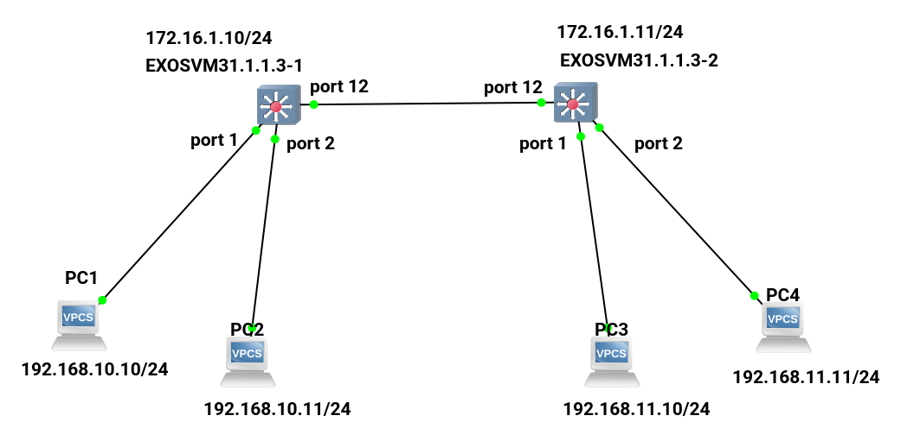
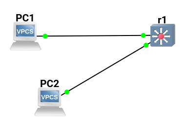
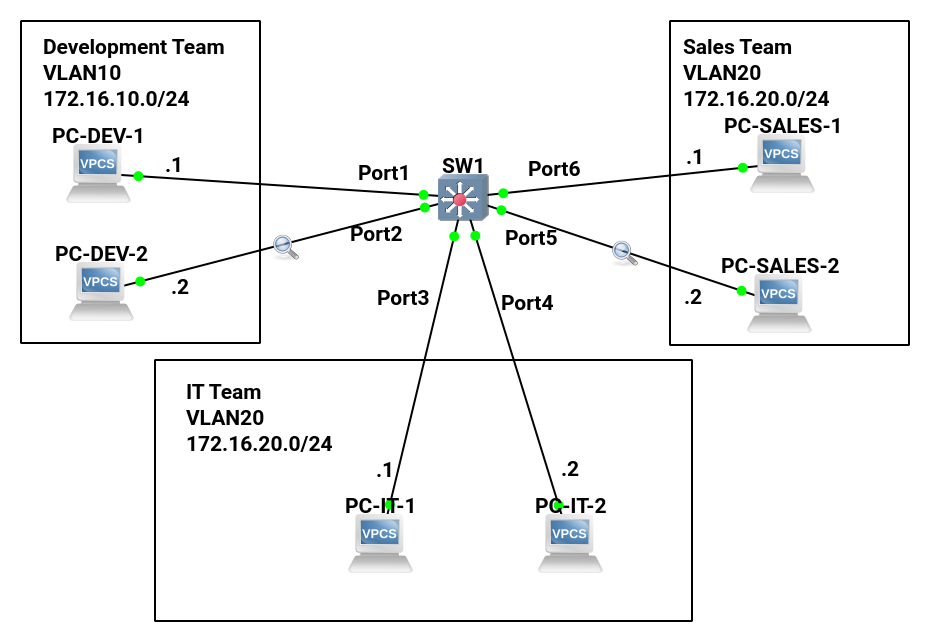
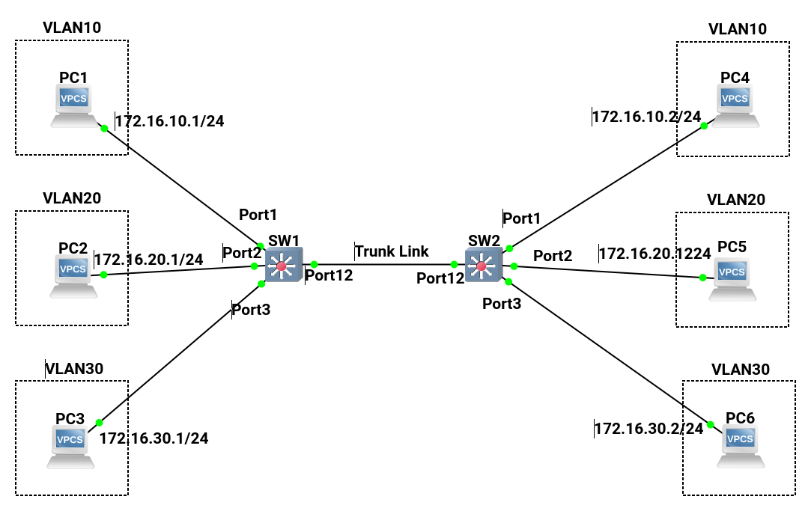
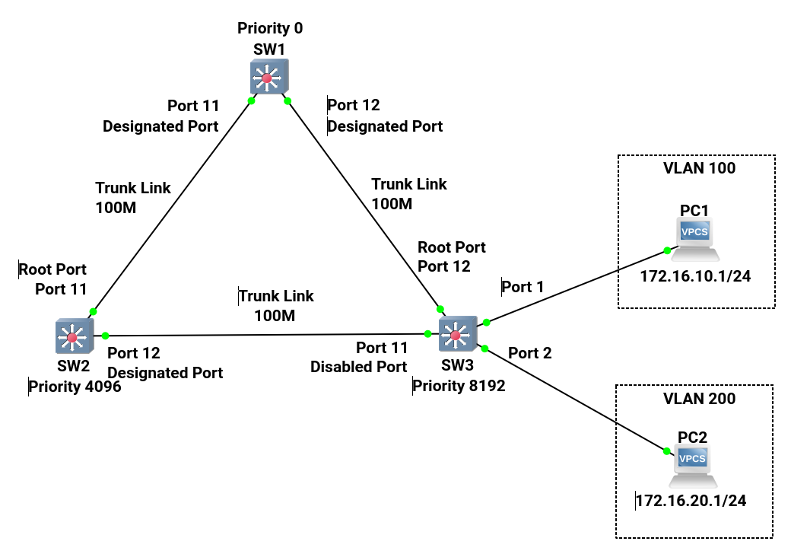
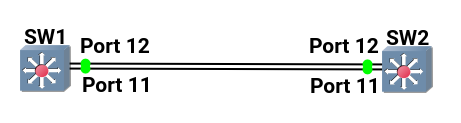
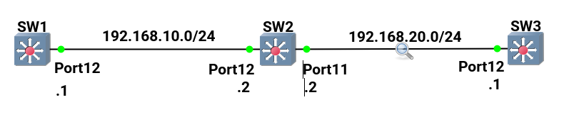

# network_practice_guide_with_gns3_and_exos

## 2-1-1_WireShark

2-1 WireSharkの基本操作

## 2-2-1_VPCS

2-2 VPCSの使い方

## 3-3-2_Sample

3-3 簡単なネットワークの構築

## 5-2-2_VLAN

5-2-2 アクセスポートの設定

## 5-3-3_Trunk

5-3-3 トランクリンクの設定

## 5-4-2_VTP-replaced_by_MVRP

WIP

## 5-5-3_STP

5-5-4 PVST+の動作確認と収束時間の短縮

Edge Port(PortFreeのEXOS版)は試していない。

## 5-6-2_EtherChannel_replaced_by_Sharing_Port

5-6-2 EtherChannelの設定

## 9-2-1_RIP_Basic

9-2-1 RIPの有効化

## メモ

* Extreme Switchで試されない機能
  * フレームリレー
  * ATM
  * PPP、PPPoE